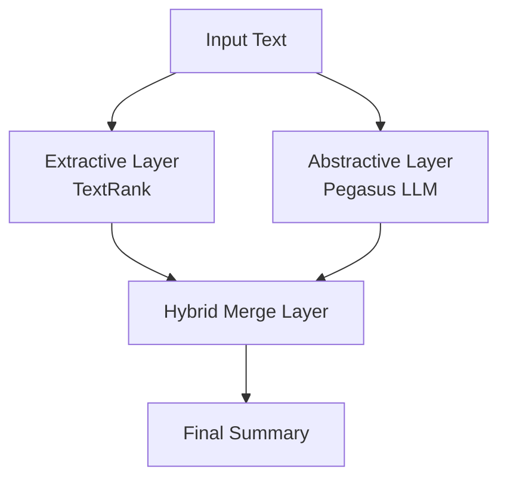

# 🚀 Hybrid Text Summarization System
### TextRank + Pegasus (LLM)
**Algorithm Design Course Project – Phase 1 & Phase 2**

---

## 📌 Overview

This project implements a **Hybrid Text Summarization System** that integrates:

- **Extractive Summarization (TextRank)** – Graph-based ranking
- **Abstractive Summarization (Pegasus LLM)** – Transformer-based generation

The system combines deterministic ranking with neural generation to produce summaries that are:

- Factually grounded  
- Linguistically coherent  
- Structurally optimized  
- Redundancy-aware  

---

## ✨ Key Features

- Dual-Engine Architecture (Graph Theory + Deep Learning)
- Optimized TextRank with Sparse TF-IDF + Min-Heap (O(N log K))
- Local Pegasus Integration (Offline capable)
- Weighted Hybrid Merge Strategy
- Redundancy Filtering Mechanism
- CI/CD Pipeline (GitHub Actions + pytest + flake8)
- Interactive Web UI (Streamlit)

---

## 🏗️ System Architecture



---

## ⚙️ TextRank Module (Extractive Layer)

### Preprocessing
- Sentence segmentation
- Tokenization (NLTK)
- Stopword removal
- Porter Stemming

### Vectorization
- Sparse TF-IDF matrix
- Memory-efficient representation

### Graph Construction
- Cosine similarity matrix
- Configurable similarity threshold (θ)
- Damping factor (d = 0.85)
- Convergence tolerance (1e-4)

### Optimization Strategy
- Sparse similarity graph
- Min-Heap for Top-K selection → O(N log K)
- Reduced memory footprint

---

## 🧠 LLM Module (Abstractive Layer)

- Model: `PegasusForConditionalGeneration`
- Dynamic summary length adjustment
- Controlled decoding:
  - `top_p`
  - `top_k`
  - `temperature`
- Hallucination mitigation via constrained sampling
- Fully offline compatible (local fine-tuned model)

---

## 🔗 Hybrid Merge Strategy (Phase 2 Core Innovation)

Final scoring formula:

\[
Score_{final} = (\alpha \times Score_{TR}) + (\beta \times Score_{LLM})
\]

### Includes:

- Weighted ranking fusion
- Semantic redundancy filtering (SequenceMatcher threshold = 0.6)
- Candidate re-scoring
- Logical reordering by original sentence index
- Balanced precision–fluency tradeoff

---

## ⏱️ Complexity Analysis

| Component | Complexity |
|------------|------------|
| Sentence Vectorization | O(N × V) |
| Graph Construction | O(N² · V_avg + N log K) |
| PageRank Convergence | O(I × E) |
| Merge Logic | O(M²), where M ≪ N |

---

## 🧪 Testing & CI/CD

### Unit Testing
- Framework: `pytest`
- Graph correctness validation
- Weight formula verification
- Redundancy filter tests
- LLM mocked during tests for lightweight execution

### Code Quality
- `flake8` (PEP8 compliance)
- Modular architecture validation

### GitHub Actions
Every push to `main` triggers:

- Virtual environment build
- Dependency installation
- Unit test execution
- Style validation

---

## 📂 Project Structure

```
Algorithm-Project-HybridSummarizer-Group4/
│
├── .github/workflows/
│   └── ci-pipeline.yml
│
├── src/
│   ├── textrank/
│   │   ├── textrank.py
│   │   └── utils.py
│   │
│   ├── llm/
│   │   └── llm_integration.py
│   │
│   └── merge/
│       └── merge_strategy.py
│
├── tests/
│   └── test_pipeline.py
│
├── app.py
├── requirements.txt
└── README.md
```

---

## 🛠️ Installation

### 1️⃣ Clone Repository

```bash
git clone https://github.com/YourUsername/Project-Name.git
cd Project-Name
```

### 2️⃣ Create Virtual Environment (Recommended)

```bash
python -m venv venv
source venv/bin/activate      # Linux / Mac
venv\Scripts\activate         # Windows
```

### 3️⃣ Install Dependencies

```bash
pip install -r requirements.txt
```

---

## ▶️ Run Web Interface

```bash
streamlit run app.py
```

Then open:

```
http://localhost:8501
```

---

## 📊 Example Workflow

1. Paste input text  
2. Select summary length  
3. System generates:
   - Extractive summary
   - Abstractive summary
   - Hybrid optimized summary  

---

## 🧠 Edge Cases Evaluated

- Technical documentation
- Highly redundant paragraphs
- Short input snippets
- Repeated sentence clusters
- Academic structured texts

---

## 📈 Future Improvements

- SBERT similarity integration
- ROUGE & BLEU evaluation metrics
- Multi-document summarization
- Reinforcement tuning of α / β
- Attention-based redundancy detection
- Performance benchmarking dashboard

---

## 🎓 Academic Context

Course: **Algorithm Design**  

Phase 1:
- Optimized TextRank implementation

Phase 2:
- Hybrid fusion logic
- Weight tuning
- Redundancy filtering
- Performance optimization

---

## 👥 Authors

Group 4  

---

## 📄 License

For academic and educational use only.
